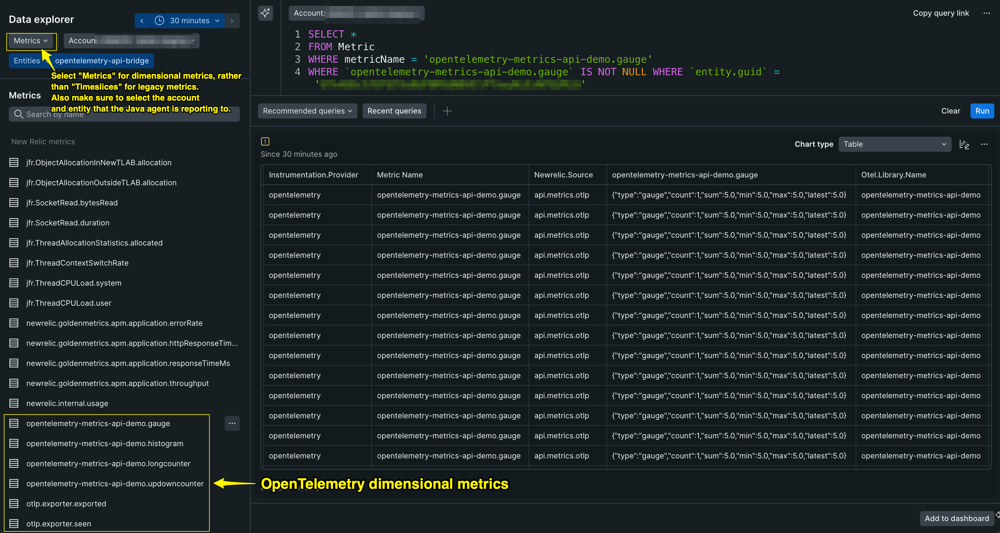
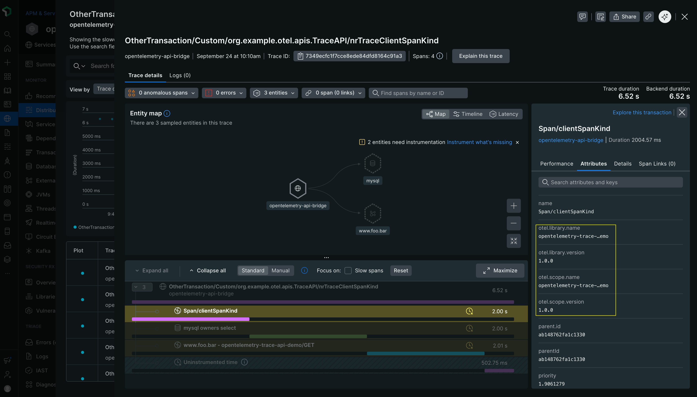
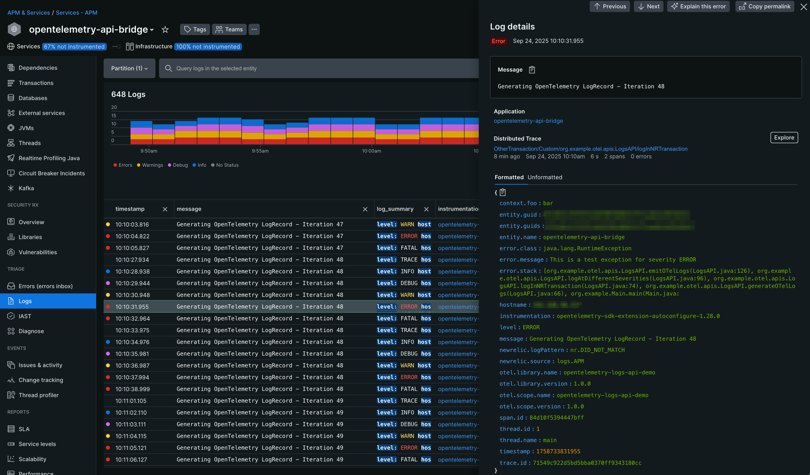

# Using OpenTelemetry APIs With The New Relic Java Agent

This project demonstrates how the New Relic Java agent can capture telemetry data from the OpenTelemetry metrics, trace, and logs APIs and associate it with the APM entity being monitored by the agent.

## Requirements

### Java

This project requires Java 17 or higher

### Java Agent

This functionality will only work with Java agent 8.11.0 or higher. `FIXME: update version when GA`

### OpenTelemetry

The Java agent instrumentation will only work with `io.opentelemetry:opentelemetry-sdk-extension-autoconfigure` version `1.17.0-alpha` or higher.

The following OpenTelemetry dependencies are required for this demo:

```groovy
    implementation(platform("io.opentelemetry:opentelemetry-bom:1.54.1"))
    implementation("io.opentelemetry:opentelemetry-sdk-extension-autoconfigure")
    implementation("io.opentelemetry:opentelemetry-api")
    implementation("io.opentelemetry:opentelemetry-exporter-otlp")
```

## New Relic Java Agent Configuration

The New Relic Java agent can capture OpenTelemetry dimensional metrics, spans, and logs when the OpenTelemetry SDK autoconfigure functionality is enabled (i.e. `-Dnewrelic.config.opentelemetry.sdk.autoconfigure.enabled=true`).

The various configuration options to control the different telemetry types are described below. These options can be set via the `newrelic.yml` file, system properties, or environment variables.

Configuration via yaml:

```yaml
  opentelemetry:
    # config to enable different types of telemetry from the OpenTelemetry SDK
    sdk:
      autoconfigure:
        enabled: true
      spans:
        enabled: true
      logs:
        enabled: true
    # instrumentation scope names which are excluded from reporting traces and logs
    instrumentation:
      specific-instrumentation-scope-name-1:
        enabled: true
      specific-instrumentation-scope-name-2:
        enabled: true
    metrics:
      # comma-separated list of meter names which are excluded from reporting metrics
      exclude: foo-module,bar-module
```

Configuration via system property:

```
-Dnewrelic.config.opentelemetry.sdk.autoconfigure.enabled=true
-Dnewrelic.config.opentelemetry.sdk.spans.enabled=true
-Dnewrelic.config.opentelemetry.sdk.logs.enabled=true

# instrumentation scope names which are excluded from reporting traces and logs
-Dnewrelic.config.opentelemetry.instrumentation.[SPECIFIC_INSTRUMENTATION_SCOPE_NAME].enabled=true

# comma-separated list of meter names which are excluded from reporting metrics
-Dnewrelic.config.opentelemetry.metrics.exclude=foo-module,bar-module
```

Configuration via environment variable:

```
NEW_RELIC_OPENTELEMETRY_SDK_AUTOCONFIGURE_ENABLED=true
NEW_RELIC_OPENTELEMETRY_SDK_SPANS_ENABLED=true
NEW_RELIC_OPENTELEMETRY_SDK_LOGS_ENABLED=true

# instrumentation scope names which are excluded from reporting traces and logs
NEW_RELIC_OPENTELEMETRY_INSTRUMENTATION_[SPECIFIC_INSTRUMENTATION_SCOPE_NAME]_ENABLED=true

# comma-separated list of meter names which are excluded from reporting metrics
NEW_RELIC_OPENTELEMETRY_METRICS_EXCLUDE=foo-module,bar-module
```

Note, if you are following along and wish to run the demo yourself, you can add your own ingest [license_key](https://docs.newrelic.com/docs/apis/intro-apis/new-relic-api-keys/#license-key) to the `newrelic.yml` file found in the `opentelemetry-api-bridge/newrelic/` directory of this project. You will also find the Java agent `newrelic.jar` file located there. By default, the Java agent will send data to a US Production data center, but you can change that by configuring `-Dnewrelic.environment=<environment>` to use one of the other environments defined in the `newrelic.yml` file.

## Build and Run The Demo

From the project root, create an executable jar:
```commandline
./gradlew shadowJar
```

From the project root, run the executable jar (entering the correct path to the `newrelic.jar`):

```commandline
java -javaagent:/full/path/to/opentelemetry-api-bridge/newrelic/newrelic.jar \
-Dnewrelic.config.opentelemetry.sdk.autoconfigure.enabled=true \
-jar build/libs/opentelemetry-api-bridge-1.0-SNAPSHOT-all.jar
```

## Visualizing OTel Telemetry Data

All dimensional metrics, spans, and logs generated with the OpenTelemetry APIs, and captured by the New Relic Java agent, will be associated with the account and entity that the APM Java agent is reporting to.

### Dimensional Metrics

Any dimensional metrics generated with the OpenTelemetry APIs will be associated with the account and entity that the APM Java agent is reporting to. You can view dimensional metrics in the New Relic Data Explorer by selecting "Metrics" as the data type and specifying the correct account and entity name. You should see something like the following:



### Traces

Any Spans generated with the OpenTelemetry APIs can be directly queried or viewed in the context of the "Transactions" and "Distributed Tracing" UIs.



### Logs

Any Logs generated with the OpenTelemetry APIs can be directly queried or viewed in the Logs UI. Any logs that were emitted within an active New Relic transaction can also be viewed in the context of the "Transactions" and "Distributed Tracing" UIs.



## Caveats

### Triggering The Autoconfigure Instrumentation

The Java agent instruments the `opentelemetry-sdk-extension-autoconfigure` library to capture OTel telemetry. This dependency must be present and enabled for the instrumentation to run. It can be enabled by either setting `-Dotel.java.global-autoconfigure.enabled=true` or programmatically calling `AutoConfiguredOpenTelemetrySdk.initialize().getOpenTelemetrySdk()`.

### OpenTelemetry Metrics Exporter

By default, the OpenTelemetry [Metrics Exporter](https://opentelemetry.io/docs/specs/otel/metrics/sdk_exporters/otlp/) will be set to [otlp](https://opentelemetry.io/docs/specs/otel/configuration/sdk-environment-variables/#exporter-selection), which is what is required for the functionality described in this demo to work. If the exporter was changed to a different option (e.g. `-Dotel.metrics.exporter=console`) then the dimensional metrics would not be sent to New Relic.

### Ingest Host

Note that the dimensional metrics will be sent to the same ingest [host](https://docs.newrelic.com/docs/apm/agents/java-agent/configuration/java-agent-configuration-config-file/#cfg-host) (e.g. https://collector.newrelic.com:443) that the Java agent is configured to use and this should not be changed.
