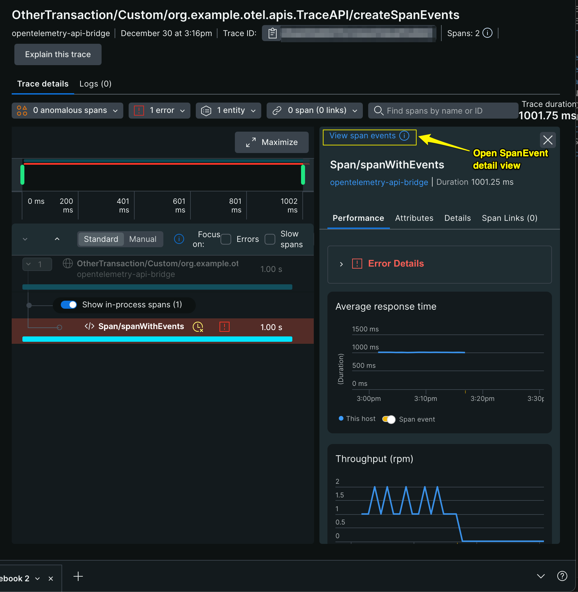
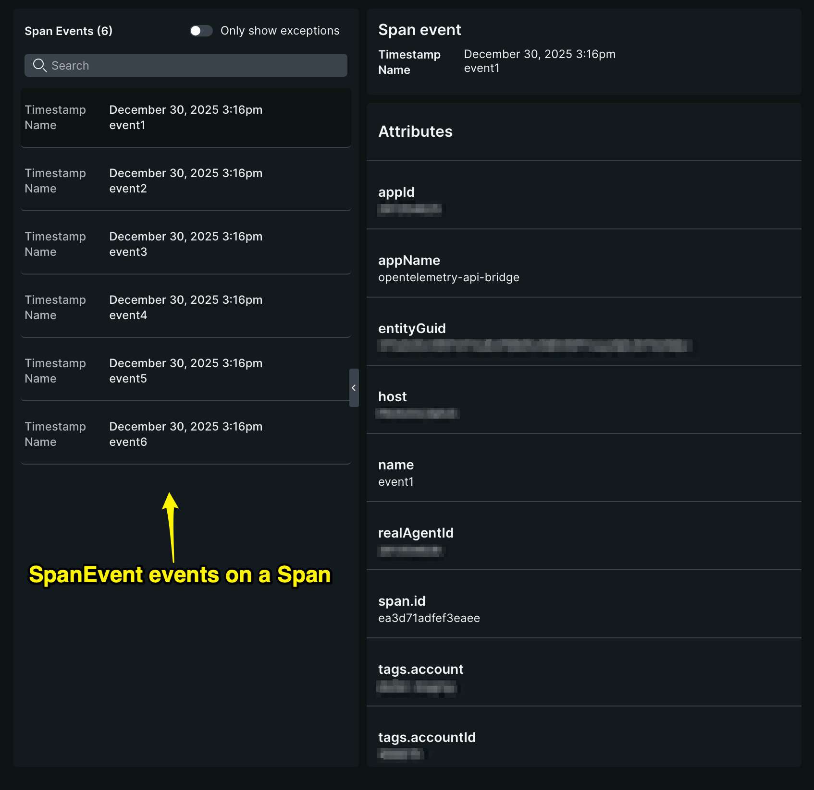
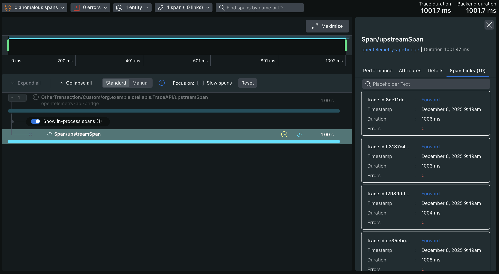
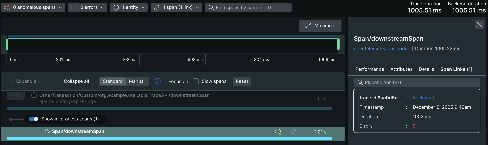

# Using OpenTelemetry APIs With The New Relic Java Agent

This project demonstrates how the New Relic Java agent instruments OpenTelemetry APIs to incorporate signals (metrics, logs, and traces) emitted by OpenTelemetry APIs into the New Relic Java agent.

The following functionality is supported:

OpenTelemetry Traces Signals
* Detect when `Span`s are emitted by OpenTelemetry APIs and incorporate them to New Relic Java agent traces.
* Detect [Links between Spans](https://opentelemetry.io/docs/specs/otel/overview/#links-between-spans) and report them to New Relic as `SpanLink` events.
* Detect [Events on Spans](https://opentelemetry.io/docs/concepts/signals/traces/#span-events) and report them to New Relic as `SpanEvent` events.

OpenTelemetry Dimensional Metrics Signals
* Autoconfigure the OpenTelemetry SDK to export dimensional metrics (over OTLP) to the APM entity being monitored by the Java agent.

OpenTelemetry Logs Signals
* Detect when `LogRecord`s are emitted by OpenTelemetry APIs report them to the APM entity being monitored by the Java agent as New Relic LogEvents.

## Requirements

### Java

This project requires Java 17 or higher

### Java Agent

This functionality will only work with Java agent `9.1.0` or higher.

## OpenTelemetry Requirements

The [opentelemetry-sdk-extension-autoconfigure](https://central.sonatype.com/artifact/io.opentelemetry/opentelemetry-sdk-extension-autoconfigure) dependency (version 1.28.0 or later) must be present in the application being monitored for this instrumentation module to apply. The [opentelemetry-exporter-otlp](https://central.sonatype.com/artifact/io.opentelemetry/opentelemetry-exporter-otlp) dependency (version 1.28.0 or later) must also be present for dimensional metrics to be exported to New Relic.

```groovy
implementation(platform("io.opentelemetry:opentelemetry-bom:1.54.1"))
implementation("io.opentelemetry:opentelemetry-sdk-extension-autoconfigure")
implementation("io.opentelemetry:opentelemetry-exporter-otlp")
```

Additionally, automatic configuration of the OpenTelemetry SDK must be enabled by one of the following options:

System property:
```commandline
-Dotel.java.global-autoconfigure.enabled=true
```

Environment variable:
```commandline
export OTEL_JAVA_GLOBAL_AUTOCONFIGURE_ENABLED=true
```

Programmatic:
```java
/*
 * The opentelemetry-sdk-extension-autoconfigure dependency needs to be initialized
 * by either setting -Dotel.java.global-autoconfigure.enabled=true or calling the
 * following API in order for the New Relic Java agent instrumentation to load.
 */
private static final OpenTelemetry OPEN_TELEMETRY_SDK = AutoConfiguredOpenTelemetrySdk.initialize().getOpenTelemetrySdk();
```

## New Relic Java Agent Configuration

Telemetry signals (Logs, Metrics, and Traces) emitted by OpenTelemetry APIs can be incorporated into the Java agent and controlled by the following config options.

Configuration via YAML:

```yaml
  # Telemetry signals (Logs, Metrics, and Traces) emitted by OpenTelemetry APIs can
  # be incorporated into the Java agent and controlled by the following config options.
  opentelemetry:

    # Set to true to allow individual OpenTelemetry signals to be enabled, false to disable all OpenTelemetry signals.
    # Default is false.
    enabled: true

    # OpenTelemetry Logs signals.
    logs:

      # Set to true to enable OpenTelemetry Logs signals.
      # Default is false.
      enabled: true

    # OpenTelemetry Metrics signals.
    metrics:

      # Set to true to enable OpenTelemetry Metrics signals.
      # Default is false.
      enabled: true

      # A comma-delimited string of OpenTelemetry Meters (e.g. "MeterName1,MeterName2") whose signals should be included. 
      # By default, all Meters are included. This will override any default Meter excludes in the agent, effectively re-enabling them.
      include: "MeterName1,MeterName2" 

      # A comma-delimited string of OpenTelemetry Meters (e.g. "MeterName3,MeterName4") whose signals should be excluded. 
      # This takes precedence over all other includes/excludes sources, effectively disabling the listed Meters.
      exclude: "MeterName3,MeterName4" 

    # OpenTelemetry Traces signals.
    traces:

      # Set to true to enable OpenTelemetry Traces signals.
      # Default is false.
      enabled: true

      # A comma-delimited string of OpenTelemetry Tracers (e.g. "TracerName1,TracerName2") whose signals should be included. 
      # By default, all Tracers are included. This will override any default Tracer excludes in the agent, effectively re-enabling them.
      include: "TracerName1,TracerName2"

      # A comma-delimited string of OpenTelemetry Tracers (e.g. "TracerName3,TracerName4") whose signals should be excluded. 
      # This takes precedence over all other includes/excludes sources, effectively disabling the listed Tracers.
      exclude: "TracerName3,TracerName4"
```

Configuration via system property:

```
-Dnewrelic.config.opentelemetry.enabled=true

-Dnewrelic.config.opentelemetry.logs.enabled=true

-Dnewrelic.config.opentelemetry.metrics.enabled=true
-Dnewrelic.config.opentelemetry.metrics.include=MeterName1,MeterName2
-Dnewrelic.config.opentelemetry.metrics.exclude=MeterName3,MeterName4

-Dnewrelic.config.opentelemetry.traces.enabled=true
-Dnewrelic.config.opentelemetry.traces.include=TracerName1,TracerName2
-Dnewrelic.config.opentelemetry.traces.exclude=TracerName3,TracerName4
```

Configuration via environment variable:

```
NEW_RELIC_OPENTELEMETRY_ENABLED=true

NEW_RELIC_OPENTELEMETRY_LOGS_ENABLED=true

NEW_RELIC_OPENTELEMETRY_METRICS_ENABLED=true
NEW_RELIC_OPENTELEMETRY_METRICS_INCLUDE=MeterName1,MeterName2
NEW_RELIC_OPENTELEMETRY_METRICS_EXCLUDE=MeterName3,MeterName4

NEW_RELIC_OPENTELEMETRY_TRACES_ENABLED=true
NEW_RELIC_OPENTELEMETRY_TRACES_INCLUDE=TracerName1,TracerName2
NEW_RELIC_OPENTELEMETRY_TRACES_EXCLUDE=TracerName3,TracerName4
```

Note, if you are following along and wish to run the demo yourself, you can add your own ingest [license_key](https://docs.newrelic.com/docs/apis/intro-apis/new-relic-api-keys/#license-key) to the `newrelic.yml` file found in the `opentelemetry-api-bridge/newrelic/` directory of this project. You will also find the Java agent `newrelic.jar` file located there. By default, the Java agent will send data to a US Production data center, but you can change that by configuring `-Dnewrelic.environment=<environment>` to use one of the other environments defined in the `newrelic.yml` file.

## Build and Run The Demo

From the project root, create an executable jar:
```commandline
./gradlew shadowJar
```

From the project root, run the executable jar (entering the correct path to the `newrelic.jar`):

```commandline
java -javaagent:/full/path/to/opentelemetry-api-bridge/newrelic/newrelic.jar \
-Dnewrelic.config.opentelemetry.sdk.autoconfigure.enabled=true \
-jar build/libs/opentelemetry-api-bridge-1.0-SNAPSHOT-all.jar
```

## Visualizing OTel Telemetry Data

All dimensional metrics, spans, and logs generated with the OpenTelemetry APIs, and captured by the New Relic Java agent, will be associated with the account and entity that the APM Java agent is reporting to.

### Dimensional Metrics

The [OpenTelemetry Metrics API](https://opentelemetry.io/docs/specs/otel/metrics/api/) can be used to create dimensional metrics which will be exported by the OpenTelemetry SDK to New Relic over OTLP. The dimensional metrics will be decorated with the `entity.guid` of the APM entity being monitored by the New Relic Java agent.

Any dimensional metrics generated with the OpenTelemetry APIs will be associated with the account and entity that the APM Java agent is reporting to. You can view dimensional metrics in the New Relic Data Explorer by selecting "Metrics" as the data type and specifying the correct account and entity name. You should see something like the following:


### Traces

OpenTelemetry Trace signals may result in `Span`, `SpanEvent`, and `SpanLink` events being reported to New Relic.

#### Span

The New Relic Java agent will detect Spans emitted by the [OpenTelemetry Tracing API](https://opentelemetry.io/docs/specs/otel/trace/api/) for most manual, standalone library, and native [instrumentation types](https://opentelemetry.io/docs/languages/java/instrumentation/#instrumentation-categories) and incorporate them into New Relic traces.

Any Spans generated with the OpenTelemetry APIs can be directly queried or viewed in the context of the "Transactions" and "Distributed Tracing" UIs.


#### SpanEvent

When processing OpenTelemetry Spans, any [Events](https://opentelemetry.io/docs/specs/otel/trace/api/#add-events) associated with Spans will be captured and reported to New Relic as `SpanEvent` events, which enhance the distributed tracing experience by providing log-like records that add extra details about what happened within a Span's execution.

_Events on a Span_


_Events detailed view_


#### SpanLink

When processing OpenTelemetry Spans, any [Links](https://opentelemetry.io/docs/specs/otel/trace/api/#link) associated with Spans will be captured and reported to New Relic as `SpanLink` events, which enhance the distributed tracing experience by providing backwards and forwards links between Spans from different traces.

_Forward links on a Span_


_Backward links on a Span_


### Logs

The New Relic Java agent will detect LogRecords emitted by the [OpenTelemetry Logs API](https://opentelemetry.io/docs/specs/otel/logs/api/) and incorporate them into New Relic log events associated with the APM entity being monitored. The logs will be associated with a New Relic transaction if the logging occurred within one.

Any Logs generated with the OpenTelemetry APIs can be directly queried or viewed in the Logs UI. Any logs that were emitted within an active New Relic transaction can also be viewed in the context of the "Transactions" and "Distributed Tracing" UIs.

Note: It is recommended that OpenTelemetry instrumentation for a particular logging framework (e.g. Logback, Log4j) should not be used alongside New Relic Java agent instrumentation for the same logging framework. Doing so could result in duplicate log events being reported to New Relic.


## Caveats

### Triggering The Autoconfigure Instrumentation

The Java agent instruments the `opentelemetry-sdk-extension-autoconfigure` library to capture OTel telemetry. This dependency must be present and enabled for the instrumentation to run. It can be enabled by either setting `-Dotel.java.global-autoconfigure.enabled=true` or programmatically calling `AutoConfiguredOpenTelemetrySdk.initialize().getOpenTelemetrySdk()`.

### OpenTelemetry Metrics Exporter

By default, the OpenTelemetry [Metrics Exporter](https://opentelemetry.io/docs/specs/otel/metrics/sdk_exporters/otlp/) will be set to [otlp](https://opentelemetry.io/docs/specs/otel/configuration/sdk-environment-variables/#exporter-selection), which is what is required for the functionality described in this demo to work. If the exporter was changed to a different option (e.g. `-Dotel.metrics.exporter=console`) then the dimensional metrics would not be sent to New Relic.

### Ingest Host

Note that the dimensional metrics will be sent to the same ingest [host](https://docs.newrelic.com/docs/apm/agents/java-agent/configuration/java-agent-configuration-config-file/#cfg-host) (e.g. https://collector.newrelic.com:443) that the Java agent is configured to use and this should not be changed.
